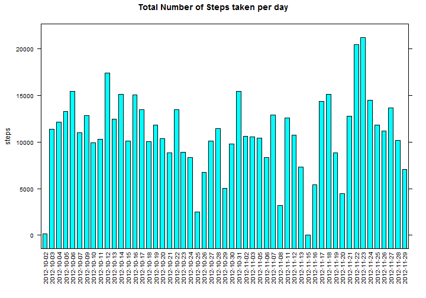
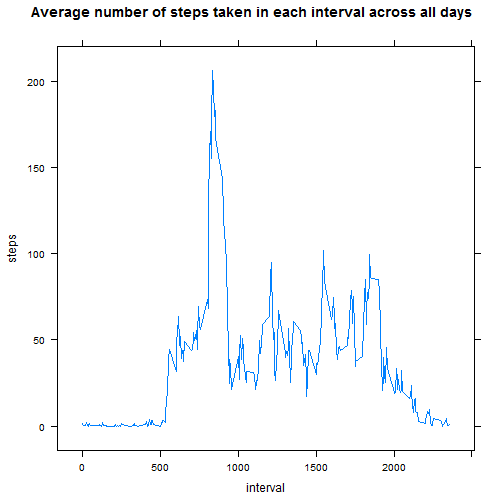
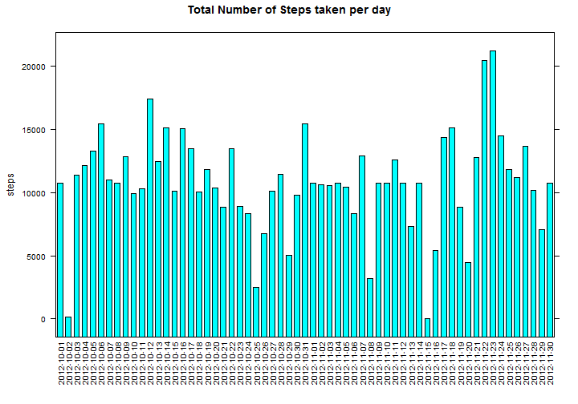
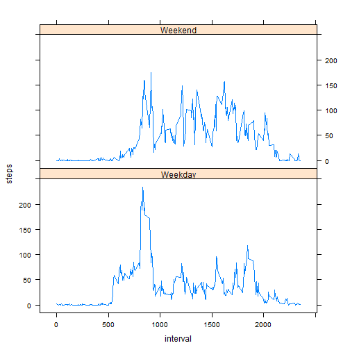

# Reproducible Research: Peer Assessment 1


## Loading and preprocessing the data

```r
dat <- read.csv("activity.csv")
noNAdat <- dat[complete.cases(dat),]
```

## What is mean total number of steps taken per day?

```r
library(lattice)
aggrStepsDat <- aggregate(steps ~ date, sum, data=noNAdat)
barchart(steps~date, data=aggrStepsDat, scales=list(x=list(rot=90)),main="Total Number of Steps taken per day")
```

 

```r
meansteps <- mean(aggrStepsDat$steps)
mediansteps <- median(aggrStepsDat$steps)
```

#### Mean total number of steps taken per day is 1.0766 &times; 10<sup>4</sup> and median total number of steps taken per day is 10765

## What is the average daily activity pattern?

```r
dailyActDat <- aggregate(steps ~ interval, mean, data=noNAdat)
fiveminmax <- dailyActDat[which.max(dailyActDat[,2]),1]
xyplot(steps ~ interval, data=dailyActDat, type="l",main="Average number of steps taken in each interval across all days")
```

 

#### The 5-minute interval that contains the maximum number of steps (on average across all days in the dataset) is 835

## Inputing missing values

```r
numNArows <- length(dat$steps) - length(noNAdat$steps)
```

#### The total number of rows with missing values in the dataset is 2304
#### New dataset has been created by replacing the NA values in steps column with the average steps taken in the corresponding interval across the dataset

```r
numNArows <- length(dat$steps) - length(noNAdat$steps)
newDat <- dat
len <- length(newDat$steps)
for (i in 1:len) {
  if (is.na(newDat$steps[i]))
  {
    index = which(dailyActDat$interval == newDat$interval[i])
    newDat$steps[i] = dailyActDat$steps[index]
  }
}
aggrStepsNewDat <- aggregate(steps ~ date, sum, data=newDat)
barchart(steps~date, data=aggrStepsNewDat, scales=list(x=list(rot=90)),main="Total Number of Steps taken per day")
```

 

```r
meanNewsteps <- mean(aggrStepsNewDat$steps)
medianNewsteps <- median(aggrStepsNewDat$steps)
```

#### After replacing all missing values, the mean total number of steps taken per day is 1.0766 &times; 10<sup>4</sup> and median total number of steps taken per day is 1.0766 &times; 10<sup>4</sup>

#### As can be seen by comparing the earlier mean and median values with the new ones, there is no change in the mean value (1.0766 &times; 10<sup>4</sup> vs 1.0766 &times; 10<sup>4</sup>) but a slight change in the median (10765 vs 1.0766 &times; 10<sup>4</sup>)

## Are there differences in activity patterns between weekdays and weekends?

#### A new factor variable is added to the dataset to indicate whether the observations were done on a weekday or a weekend

```r
noNAdat$day <- ifelse(weekdays(as.Date(noNAdat$date)) %in% c("Sunday", "Saturday"),"Weekend","Weekday")
AggrWeekDat <- aggregate(steps ~ interval + day, mean, data = noNAdat)
xyplot(steps ~ interval | day, AggrWeekDat, type="l", layout = c(1,2))
```

 

#### As can be seen from the panels, the activity pattern on weekday and weekend are different
